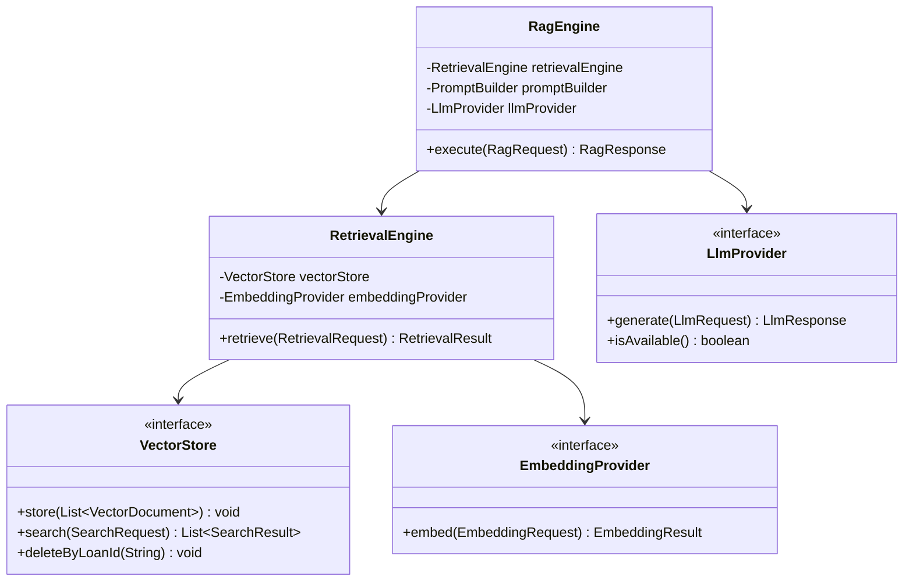

# Implementation Plan: AI Core (`ai-core`) Module Development

This document outlines the implementation plan for the core AI orchestration layer in the [ai-core](file:///Users/neelesh/projects/ai-lending-intelligence/workspace/backend/ai-core) module. Based on the [FRD.pdf](file:///Users/neelesh/projects/ai-lending-intelligence/workspace/backend/documents/files/FRD.pdf) and [TDD.pdf](file:///Users/neelesh/projects/ai-lending-intelligence/workspace/backend/documents/files/TDD.pdf), this layer must support offline-first execution, provider-level abstraction, and metadata-filtered retrieval.

---

## User Review Required

> [!IMPORTANT]
> **Spring AI Version & Compatibility:**
> The project runs on Spring Boot `3.3.0`. We propose using Spring AI version `1.0.0-M1` which is compatible with Spring Boot 3.x.
> We need to declare the Spring AI Bill of Materials (BOM) in the parent `pom.xml` and add relevant starters (`spring-ai-ollama-spring-boot-starter`, `spring-ai-pgvector-store-spring-boot-starter`) to [ai-core/pom.xml](file:///Users/neelesh/projects/ai-lending-intelligence/workspace/backend/ai-core/pom.xml).

> [!WARNING]
> **Vector Store Selection:**
> While Section 12 of the FRD recommends *ChromaDB / PGVector*, we propose focusing on **PGVector (via PostgreSQL)** since the relational database of choice for transactional data is PostgreSQL. This minimizes operational complexity by hosting vector embeddings in the same database engine.

---

## Open Questions

> [!NOTE]
> Please review and provide feedback on these items in your response:
> 1. **Primary LLM Model:** Is `llama3` (or `llama3:8b`) the assumed default local model served via Ollama, or should we configure `mistral` / `phi3`?
> 2. **Structured JSON Output:** Should the `RagEngine` support structured parsing out-of-the-box (e.g. using Spring AI `BeanOutputConverter`) for returning JSON representations like the loan summary in FR-3?
> 3. **Fallback Strategy:** If the local AI provider is down, the system should log a warning and return an informative exception allowing the workflow to degrade gracefully (e.g., marking reviews as `PENDING` rather than failing hard). Does this fit the workflow expectations?

---

## Proposed Changes

### Parent and Module Dependencies

We will update the Maven POM files to import Spring AI dependency management and add vector database & LLM drivers.

#### [MODIFY] [pom.xml](file:///Users/neelesh/projects/ai-lending-intelligence/workspace/backend/pom.xml)
- Add the Spring AI BOM `spring-ai-bom` (version `1.0.0-M1` or compatible milestone) to `<dependencyManagement>`.
- Add the Spring milestone repository (`https://repo.spring.io/milestone`) to download Spring AI dependencies.

#### [MODIFY] [pom.xml](file:///Users/neelesh/projects/ai-lending-intelligence/workspace/backend/ai-core/pom.xml)
- Add dependencies for:
  - `spring-ai-ollama-spring-boot-starter` (provides `OllamaChatModel` and `OllamaEmbeddingModel`).
  - `spring-ai-pgvector-store-spring-boot-starter` (or `spring-ai-chroma-store-spring-boot-starter` depending on configuration).
  - Spring Boot configuration processor and validation support.

---

### Component Design

---

### LLM Interface (`llm`)

We will implement the LLM provider mapping to local model servers.

#### [MODIFY] [LlmRequest.java](file:///Users/neelesh/projects/ai-lending-intelligence/workspace/backend/ai-core/src/main/java/com/ailending/aicore/llm/LlmRequest.java)
- Ensure the builder handles all configurations (prompt, model, temperature, max tokens).

#### [NEW] [OllamaLlmProvider.java](file:///Users/neelesh/projects/ai-lending-intelligence/workspace/backend/ai-core/src/main/java/com/ailending/aicore/llm/OllamaLlmProvider.java)
- Implement `LlmProvider` using Spring AI's `OllamaChatModel` (or raw `ChatModel`).
- Implement `isAvailable()` to run health check queries to verify Ollama status.

---

### Embedding Interface (`embedding`)

We will implement the text embedding generator.

#### [NEW] [EmbeddingRequest.java](file:///Users/neelesh/projects/ai-lending-intelligence/workspace/backend/ai-core/src/main/java/com/ailending/aicore/embedding/EmbeddingRequest.java)
- Fields: `String text`, `String trackingId`, `Map<String, Object> metadata`.

#### [NEW] [EmbeddingResult.java](file:///Users/neelesh/projects/ai-lending-intelligence/workspace/backend/ai-core/src/main/java/com/ailending/aicore/embedding/EmbeddingResult.java)
- Fields: `List<Double> vector`, `int dimension`, `long durationMs`.

#### [NEW] [EmbeddingProvider.java](file:///Users/neelesh/projects/ai-lending-intelligence/workspace/backend/ai-core/src/main/java/com/ailending/aicore/embedding/EmbeddingProvider.java)
- Define `EmbeddingResult embed(EmbeddingRequest request);` and check availability.

#### [NEW] [OllamaEmbeddingProvider.java](file:///Users/neelesh/projects/ai-lending-intelligence/workspace/backend/ai-core/src/main/java/com/ailending/aicore/embedding/OllamaEmbeddingProvider.java)
- Implement `EmbeddingProvider` mapping to Spring AI's `OllamaEmbeddingModel`.

---

### Vector Store Interface (`vectorstore`)

We will design the vector document schema supporting metadata-filtered retrieval.

#### [MODIFY] [VectorDocument.java](file:///Users/neelesh/projects/ai-lending-intelligence/workspace/backend/ai-core/src/main/java/com/ailending/aicore/vectorstore/VectorDocument.java)
- Implement fields mapping to TDD Section 9.4 (Metadata Design):
  - `String content` (text payload of chunk)
  - `List<Double> embedding`
  - `String loanId`
  - `String customerId`
  - `String documentType` (e.g. `SALARY_SLIP`, `BANK_STATEMENT`)
  - `String sourceDocumentId`
  - `long ingestionTimestamp`
  - `int chunkSequence`
  - `String policyVersion` (optional, for policies)

#### [NEW] [SearchRequest.java](file:///Users/neelesh/projects/ai-lending-intelligence/workspace/backend/ai-core/src/main/java/com/ailending/aicore/vectorstore/SearchRequest.java)
- Fields: `List<Double> queryVector`, `int topK`, filters (`loanId`, `customerId`, `documentType`, `policyVersion`).

#### [NEW] [SearchResult.java](file:///Users/neelesh/projects/ai-lending-intelligence/workspace/backend/ai-core/src/main/java/com/ailending/aicore/vectorstore/SearchResult.java)
- Fields: `VectorDocument document`, `double similarityScore`.

#### [MODIFY] [VectorStore.java](file:///Users/neelesh/projects/ai-lending-intelligence/workspace/backend/ai-core/src/main/java/com/ailending/aicore/vectorstore/VectorStore.java)
- Define operations:
  - `void store(List<VectorDocument> documents)`
  - `List<SearchResult> search(SearchRequest request)`
  - `void deleteByLoanId(String loanId)`

#### [NEW] [SpringVectorStoreWrapper.java](file:///Users/neelesh/projects/ai-lending-intelligence/workspace/backend/ai-core/src/main/java/com/ailending/aicore/vectorstore/SpringVectorStoreWrapper.java)
- Implement `VectorStore` wrapping Spring AI's unified `VectorStore` interface (mapping metadata fields to `Filter.Expression` parameters).

---

### Retrieval Layer (`retrieval`)

The retrieval engine matches the user query vector against specific documents and metadata filters.

#### [NEW] [RetrievalRequest.java](file:///Users/neelesh/projects/ai-lending-intelligence/workspace/backend/ai-core/src/main/java/com/ailending/aicore/retrieval/RetrievalRequest.java)
- Fields: `String query`, `String loanId`, `String customerId`, `String documentType`, `int topK`.

#### [NEW] [RetrievalResult.java](file:///Users/neelesh/projects/ai-lending-intelligence/workspace/backend/ai-core/src/main/java/com/ailending/aicore/retrieval/RetrievalResult.java)
- Fields: `List<SearchResult> hits`, `long searchDurationMs`.

#### [MODIFY] [RetrievalEngine.java](file:///Users/neelesh/projects/ai-lending-intelligence/workspace/backend/ai-core/src/main/java/com/ailending/aicore/retrieval/RetrievalEngine.java)
- Implement coordinates:
  1. Calls `EmbeddingProvider` to vectorize the query string.
  2. Builds `SearchRequest` with filters.
  3. Queries `VectorStore` and returns ranked list of relevant text chunks.

---

### Prompts Layer (`prompt`)

We will implement prompt assembly to load templates dynamically.

#### [NEW] [PromptTemplate.java](file:///Users/neelesh/projects/ai-lending-intelligence/workspace/backend/ai-core/src/main/java/com/ailending/aicore/prompt/PromptTemplate.java)
- Support system instructions and placeholders:
  - Summarization Template (for loan summary)
  - Underwriting Assessment Template (risk check)
  - Policy QA Template (resolving questions based on policy vectors)

#### [NEW] [PromptBuilder.java](file:///Users/neelesh/projects/ai-lending-intelligence/workspace/backend/ai-core/src/main/java/com/ailending/aicore/prompt/PromptBuilder.java)
- Utility to replace variables in `PromptTemplate` and append context chunks.

---

### RAG Layer (`rag`)

Coordinates end-to-end question answering.

#### [NEW] [RagRequest.java](file:///Users/neelesh/projects/ai-lending-intelligence/workspace/backend/ai-core/src/main/java/com/ailending/aicore/rag/RagRequest.java)
- Fields: `String query`, `String loanId`, `String customerId`, `String promptTemplateName`, `Map<String, Object> additionalVariables`.

#### [NEW] [RagResponse.java](file:///Users/neelesh/projects/ai-lending-intelligence/workspace/backend/ai-core/src/main/java/com/ailending/aicore/rag/RagResponse.java)
- Fields: `String answer`, `List<SearchResult> sourceReferences`, `String modelUsed`, `double confidenceScore`, `long durationMs`.

#### [MODIFY] [RagEngine.java](file:///Users/neelesh/projects/ai-lending-intelligence/workspace/backend/ai-core/src/main/java/com/ailending/aicore/rag/RagEngine.java)
- Flow:
  1. Retrieve relevant chunks using `RetrievalEngine`.
  2. Compile the context and user query into prompt template via `PromptBuilder`.
  3. Invoke `LlmProvider` with the prompt.
  4. Build and return `RagResponse` with confidence score assessment and sources metadata.

---

## Verification Plan

### Automated Tests
1. **Unit Tests:**
   - Test prompt parsing and variable replacement in `PromptBuilderTest`.
   - Test request validation on DTO builder objects (`LlmRequestTest`).
2. **Integration Tests (using Mockito for AI services or Testcontainers for pgvector):**
   - Test vector metadata expression creation in `SpringVectorStoreWrapperTest`.
   - Verify retrieval flows using an in-memory representation.
   - Run a test container representing Postgres with pgvector to verify metadata searches.

### Manual Verification
- Expose basic mock endpoints via [LendingController](file:///Users/neelesh/projects/ai-lending-intelligence/workspace/backend/app/src/main/java/com/ailending/app/controller/LendingController.java) to check if we can ingest dummy text and execute queries.
